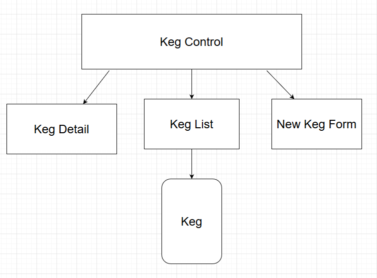

# _Tap-Room_
An independent project for React Fundamentals.

### _**Geof Rosenmund**_

[Epicodus](https://www.epicodus.com/) - [React](https://www.learnhowtoprogram.com/react) - [React Fundamentals](https://www.learnhowtoprogram.com/react/react-fundamentals)

#### Date created: 04/23/2021
---

## Technologies Used

* _JavaScript_
* _JSX_
* _React_
* _SASS_
* _draw.io_
* _git 2.30.0_

---

## Description

A React web app for creating beers for a tap room. It allows users to add new keg varieties to the bar. Clicking on the name of the beer brings up more details. These details include the price per pint, the ABV, a description, and the nuumber of pints remaining in the keg. When a keg has less than 25 pints remaining, its list card and detail card will turn a burnt orange. When there are less than 10 pints left in the keg, the cards turn a dark red. Once the pint quantity hits 0, the Serve button disappers and is replace with a swap keg button. A message is displayed stating that this keg is empty. Clicking the button refreshes the quantity back to 124 pints and changes the color of the card back to its default black.

## Component Diagram
Diagram showing parent and children components and how they will be structured in relation to one another:

---

## Setup/Installation

* To clone this directory, navigate in your terminal to the desired location of the project and run command `git clone https://github.com/CrankyJones/tap-room.git`
* Navigate to top level of the directory with command `cd tap-room`
* Run local server with command `npm run start`

---

## Editing Instructions

* To use Visual Studio Code to edit this project, follow install instructions [here](https://code.visualstudio.com/).
* To enable command `code`, open VS Code, click on View > Command Palette, type in "shell command", and click on "Shell Command: Install 'code' command in PATH"
* Now, from your terminal, in the project's top level directory, you can run command `code .` to open project in VS Code.

---

## Known Bugs

---

## License

[MIT](LICENSE.txt)

---

## Contact Information

* _Contact Geof via [Email](mailto:geof.rosenmunds.email@gmail.com) or [LinkedIn](https://www.linkedin.com/in/geofrosenmund/), or check out his [Github](https://github.com/CrankyJones)._